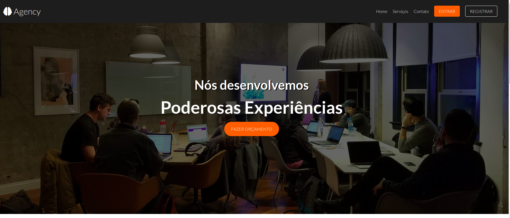
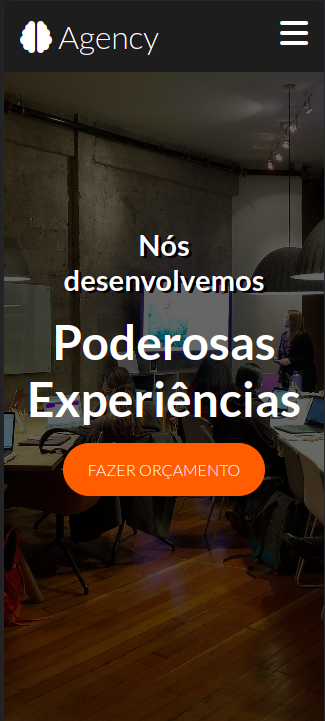

# Landing page build with Sass

- Mixins
- Placeholder Selectors
- MediaQueries
- Variables
- Nesting
- Parent Selector (&)

## Scripts

> serve html and watch changes in sass files

```sh
npm start
```

## Screenshots

[Clique aqui](https://lp-agency-sass.vercel.app/) para acessar o deploy do projeto :)





